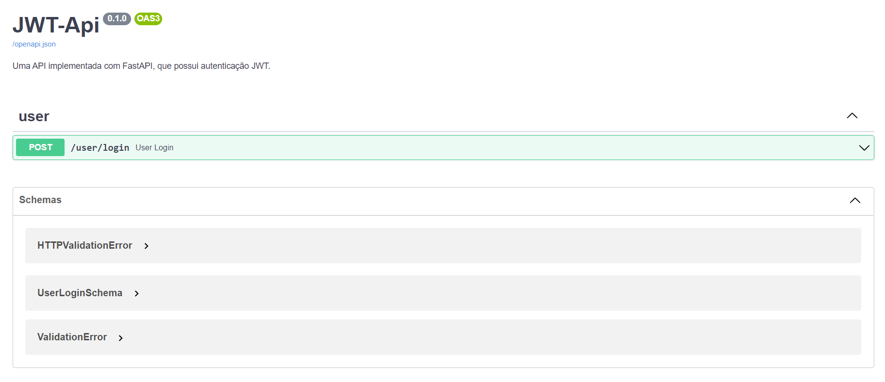
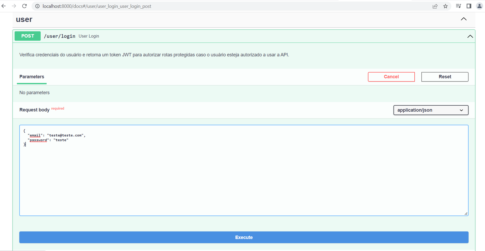
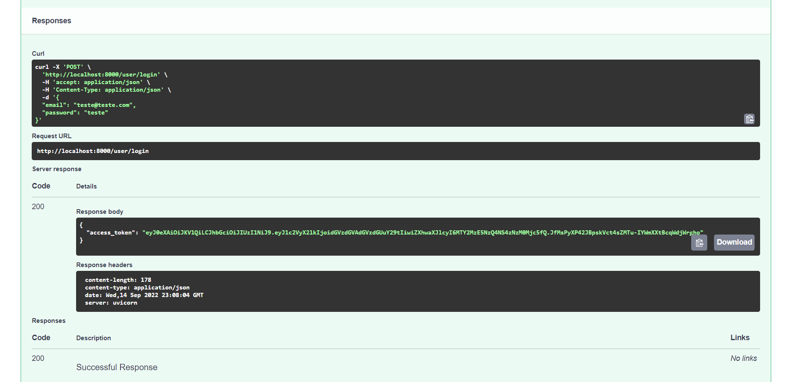
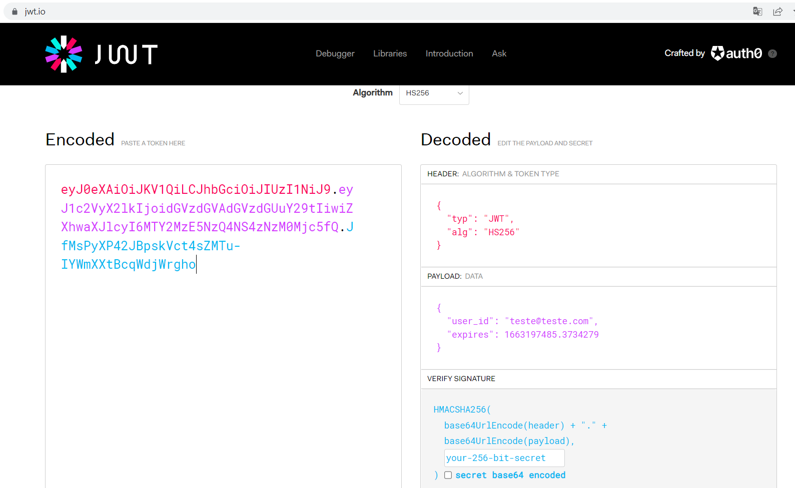

# ExemploJwt

## Como utilizar a API
Clone o repositório:   
```
git clone https://github.com/carachato/ExemploJwt.git
```

Dentro da pasta do repositório, crie um arquivo chamado `.env`:
```
SECRET=...
ALGORITHM=...
USER_EMAIL=...
USER_PASS=...
```

Construa a imagem do Docker:
```
docker build -t jwt_api .
```

Defina o container:
```
docker run --env-file=.env --name jwt_container -p 8000:8000 jwt_api
```

### Autenticação

- Acesse http://localhost:8000/docs  


- Efetue o Get passando o email e senha definido por vc no .env


- Copie o token gerado e valide suas informações no site jwt.io


- Valide de acordo ao Algorithm escolhido


## Referências:
- [FastAPI](https://fastapi.tiangolo.com/)
- [JWT auth](https://testdriven.io/blog/fastapi-jwt-auth/)

